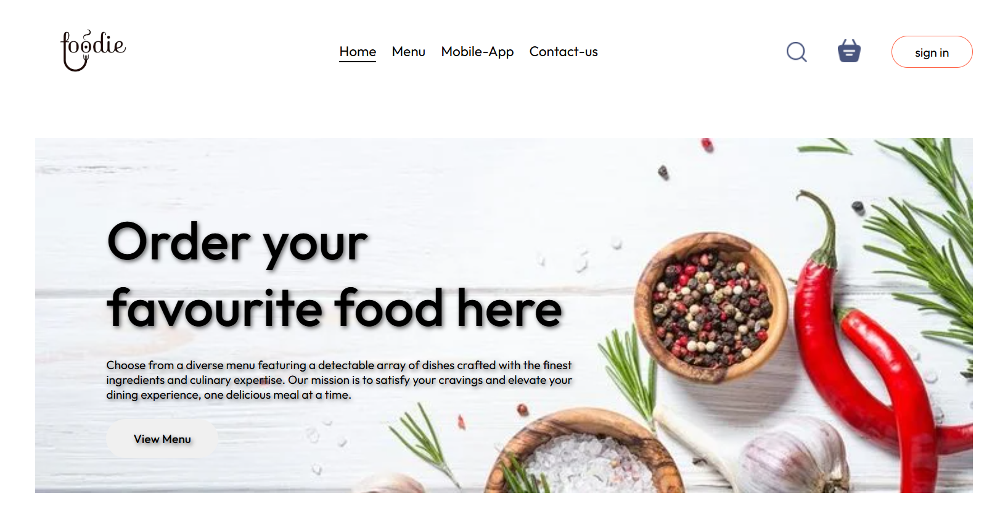
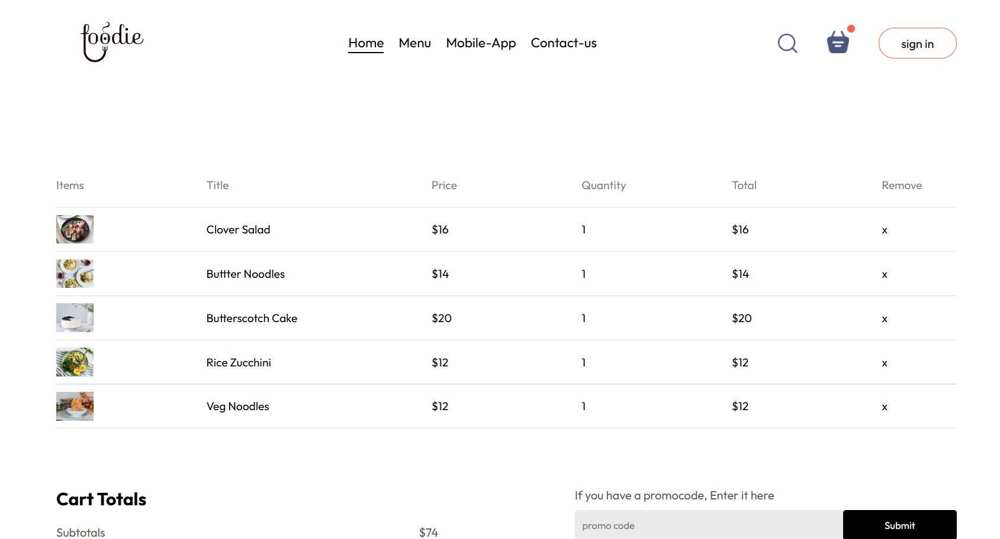
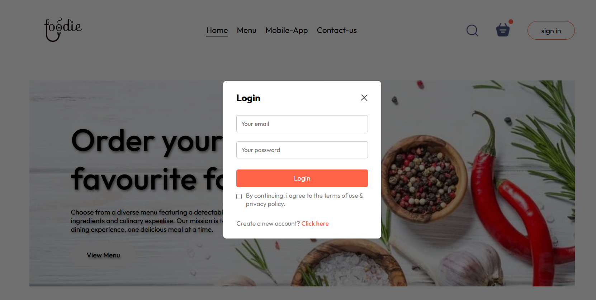

# 🍴 FOODIE - Food Ordering Website

**FOODIE** is a full-stack, responsive food ordering platform built using the **MERN Stack** (MongoDB, Express.js, React.js, Node.js). It delivers a seamless and user-friendly experience for both customers and administrators to order and manage food online.

---

## 🚀 Live Demo

- 👨‍🍳 **User Panel**: [food-del-frontend-1a6v.onrender.com](https://food-del-frontend-1a6v.onrender.com)

---

## ✨ Features

### 👥 User Panel

- 🔐 User Signup & Login (JWT Auth)
- 🍕 Browse & Filter Food Items
- 🛒 Add to Cart
- 💳 Place Orders
- 📦 View & Track Orders
- 🚪 Logout
- 🎨 Beautiful UI & Alerts

### 🛠️ Admin Panel

- 🔐 Admin Authentication
- ➕ Add / ✏️ Edit / ❌ Delete Products
- 📄 View Orders
- 👤 Role-Based Access Control
- 🔒 Secured APIs

---

## 🔒 Authentication & Security

- JWT Authentication
- Bcrypt Password Hashing
- Role-Based Authorization
- Protected REST APIs

---

## 📸 Screenshots

> Upload your screenshots inside the `/screenshots` folder

| Hero Section                    | Products                                | Cart                            |
| ------------------------------- | --------------------------------------- | ------------------------------- |
|  |  |  |

| Login Popup                       |
| --------------------------------- |
|  |

---

## 🛠 Installation & Setup (Frontend + Backend)

```bash
# 1. Clone the Repository
git clone https://github.com/PrachiLikhar/Food-del.git
cd Food-del

# 2. Install Frontend Dependencies
cd frontend
npm install

# 3. Install Backend Dependencies
cd ../backend
npm install

# 4. Create Environment File in backend folder
# Create a .env file and add:
JWT_SECRET=your_secret_key
MONGO_URL=your_mongodb_connection_string

# 5. Configure URLs

# In frontend/src/StoreContext.js
# Replace:
const url = "YOUR_BACKEND_URL";

# In backend/controllers/orderController.js
# Replace:
const frontend_url = "YOUR_FRONTEND_URL";

# 6. Run the Backend Server
cd backend
nodemon server.js

# 7. Run the Frontend Server (open new terminal)
cd frontend
npm start
🧰 Tech Stack
React.js

Node.js

Express.js

MongoDB

JWT Authentication

Multer (image upload)

☁️ Deployment
Deployed on Render

🤝 Contributing
Contributions are welcome!
Feel free to fork the repo, open issues, or submit pull requests.

📬 Feedback
For feedback or issues, reach out via GitHub Issues

Made with ❤️ by @PrachiLikhar
```
